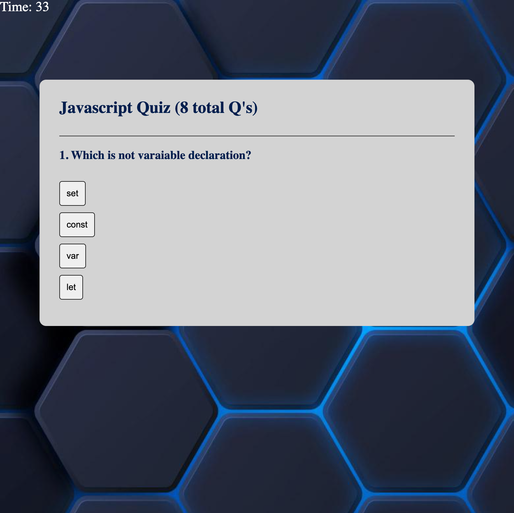

# Quiz App

## Description

The main goal of this project is to build a timed coding quiz with multiple-choice questions. This app will run in the browser and will feature dynamically updated HTML and CSS powered by JavaScript code that you write. It will also have a clean and polished, responsive user interface that adapts to multiple screen sizes.
 
After completion of the project, I have a better understanding on declaring/calling variables, functions, arrow-functions, if-statments, callbacks and for loops. I also learned some better ways to refactor the JavaScript code, thus making the code easier to read and more modular!

## Table of Contents

- [Installation](#installation)
- [Usage](#usage)
- [Credits](#credits)
- [License](#license)
- [Badges](#badges)
- [Features](#features)
- [Tests](#tests)
- [Links](#links)

## Installation

Chrome and/or Firefox are the preferred browsers to view to the program.
 
For the IDE, use Vs Code as well as the "Open with Live Server" Extension.

Steps Include:

- Install tools (Highly recommend an up to date web browser for JavaScript)
- Clone repository
- Pull to local sytem
- Create environment using extension

## Usage

Here's what the expected output should be:

## Links

Link to deployed application:
 
[logo]: https://prismhead26.github.io/Quiz_App/ "Quiz App live application"
 
Link to HTML file:
 
[HTML](/home.html)
[HTML](/leaderboard.html)
 
Link to CSS file:
 
[CSS](/assets/CSS/reset.css)
 
Link to JavaScript file:
 
[JavaScript](/home.js)
[JavaScript](/leaderboard.js)
 
Link to README file:
 
[README](/README.md)

## Credits

N/A

## License

Please refer to the LICENSE in the repo.

## Badges

 

 

## Features

JavaScript, variables, functions, if statements, callback functions, DOM HTML, time inerval, etc.
 
CSS, reset.
 
Basic HTML template with semantic elements.

## Tests

In order to test, run the program using the "Open with Live Server" Exstension.
 
I would also have DevTools open to see the logs.
